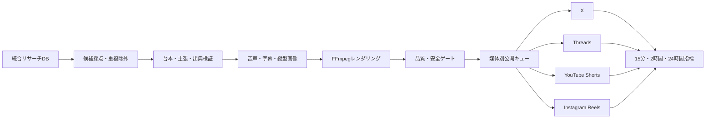

# Short Video Factory 🎬

## 概要

統合リサーチDBから根拠付きのテーマを選び、45〜60秒の縦型動画を生成して、
X・Threads・YouTube Shorts・Instagram Reelsへ配信するパイプラインです。



## 実装済み機能 ✅

- 統合リサーチDBから候補抽出、採点、同一テーマの再利用抑止
- 台本、主張、一次資料、数値根拠の保存と安全確認
- Windows SAPIまたはOpenAI TTSによる音声生成
- SRT・WebVTT・JSON字幕の生成
- 日本語フォント対応の1080×1920画像生成
- FFmpegによるH.264/AACの縦型MP4生成
- 画角、尺、音声、字幕、品質、安全性の公開前チェック
- X、Threads、YouTube、Instagramの媒体別公開処理
- 媒体別の時差公開、冪等キー、再試行、ポリシー保留
- 15分・2時間・24時間の指標取得と欠損値を維持したDB保存
- API呼び出し、外部書き込み、失敗理由、成果指標の監査ログ
- Discordへの結果通知
- Windowsタスクによる2時間ごとの生成と15分ごとのキュー処理

## 安全ゲート 🔒

外部公開は、次の条件をすべて満たした場合だけ行います。

- `SHORT_VIDEO_AUTO_PUBLISH_ENABLED=true`
- 対象媒体の自動投稿フラグが`true`
- 原則Phase D
- 公開済みサンプル30件以上
- 直近10件が品質・安全基準を通過
- 品質8点以上、安全9点以上
- マスターMP4と媒体別ファイルが存在
- 緊急停止が解除済み
- 必要な認証情報と公開HTTPS URLが有効

Phase B/CでYouTubeへ限定公開テストを行う場合だけ、
`SHORT_VIDEO_YOUTUBE_PHASE_B_UPLOAD_ENABLED=true`を明示設定します。

## 基本コマンド 🛠️

```powershell
.\.venv\Scripts\python.exe .\local_bot.py short-video-status
.\.venv\Scripts\python.exe .\local_bot.py short-video-candidates
.\.venv\Scripts\python.exe .\local_bot.py short-video-full-cycle --topic-id 1
.\.venv\Scripts\python.exe .\local_bot.py short-video-publish-plan --video-id <ID>
.\.venv\Scripts\python.exe .\local_bot.py short-video-queue-run --live --limit 10
.\.venv\Scripts\python.exe .\local_bot.py short-video-scheduled-run --live
```

個別公開コマンドは既定でdry-runです。実公開には`--live --confirm`が必要で、
その場合も全安全ゲートを通過しなければ外部書き込みは行いません。

## Windowsタスク

```powershell
powershell.exe -ExecutionPolicy Bypass -File .\production\register_short_video_tasks.ps1
```

- `PoliticsNarrativeShortVideoFactory`: 2時間ごとに候補選定・動画生成
- `PoliticsNarrativeShortVideoQueue`: 15分ごとに公開キューと指標同期

登録内容だけを確認する場合は`-WhatIf`を付けます。

## Threads・Instagram用メディア配信

Meta APIは外部から取得できるHTTPS動画URLを必要とします。
`short_video_media_server.py`はDBに保存された有効期限付きトークンと一致する
MP4だけを配信します。任意ファイル、ディレクトリ一覧、期限切れURLは公開しません。

```powershell
powershell.exe -ExecutionPolicy Bypass -File .\production\short_video_media_start.ps1
```

Tailscale Funnelでは`/short-media`をローカル8766番へ転送します。

## 外部依存

- YouTube公開: OAuth client、refresh token、channel ID
- Instagram公開: Professional account、Meta連携、user ID、access token
- Threads公開: user ID、access token、公開HTTPS動画URL
- X動画公開: OAuth 1.0aの投稿権限
- 本番公開移行: Phase D条件を満たす安全サンプル

認証不足や審査待ちの場合、その媒体だけを保留し、他の監視・生成処理は継続します。
